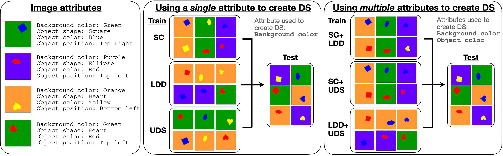

# An Analysis of Model Robustness across Concurrent Distribution Shifts
### by Myeungho Jeon*, Suhwan Choi*, Hyoje Lee, Teresa Yeo
Official implementation of our [TMLR paper](https://arxiv.org/abs/2501.04288). This repository builds upon [DomainBed](https://github.com/facebookresearch/DomainBed).



## Abstract
Machine learning models, meticulously optimized for source data, often fail to predict target data when faced with distribution shifts (DSs). Previous benchmarking studies, though extensive, have mainly focused on simple DSs. Recognizing that DSs often occur in more complex forms in real-world scenarios, we broadened our study to include multiple concurrent shifts, such as unseen domain shifts combined with spurious correlations. We evaluated 26 algorithms that range from simple heuristic augmentations to zero-shot inference using foundation models, across 168 source-target pairs from eight datasets. Our analysis of over 100K models reveals that (i) concurrent DSs typically worsen performance compared to a single shift, with certain exceptions, (ii) if a model improves generalization for one distribution shift, it tends to be effective for others, and (iii) heuristic data augmentations achieve the best overall performance on both synthetic and real-world datasets.
## Installation
```sh
conda create -n ds python=3.9
conda activate ds
```
```
pip install -r requirements.txt
```
[Install pytorch 2.2.1 with torchvision 0.17.1](https://pytorch.org/get-started/previous-versions/)

for Phi-3.5 support:
```
pip install flash-attn --no-build-isolation
```
## Running experiments
Preprocessed datasets will be available soon!

Set the dataset, model configuration, learning rate, and output directory information in ''run.sh'':
```sh
GPU=0
DATASET=CELEBA       #DSPRITES, SHAPES3D, SMALLNORB, DEEPFASHION, CELEBA, iwildcam, FMOW, CAMELYON17
DISTRIBUTION=SC      #SC, LDD, UDS, SC_LDD, SC_UDS, LDD_UDS, SC_LDD_UDS
ALGORITHM=ERM        #ERM, ADA, ME_ADA, SagNet, L2D, IRM, CausIRL_MMD, CausIRL_CORAL, UBNet, PnD, GroupDRO, BPA
ARCH=resnet18        #resnet18, resnet50, resnet101, vit, mlp
AUG=no_aug           #no_aug,imgnet,augmix,randaug,autoaug
OUTDIR=../exps            
LR=0.0001            
ATTR=0               #[0,2] for single DS, [0,5] for concurrent DS
PRETRAIN=1           #0 for scratch, 1 for PRETRAIN
DATADIR=datadir      #directory where datasets are

bash do_exp.sh $GPU $DATASET $DISTRIBUTION $ALGORITHM $ARCH $AUG $OUTDIR $LR $ATTR $PRETRAIN $DATADIR &
```
Then, run the command:
```sh
sh run.sh
```

### Zero-shot experiments
Set the dataset, model, prompt in ''run.sh'':
```sh
OUTDIR=../rob_exps/zeroshot
MODE=Phi-3.5
PROMPT=tailored

DATASET=SHAPES3D
python run_zeroshot.py --mode $MODE --output_dir $OUTDIR --prompt_type $PROMPT --dataset $DATASET &
```


## License

This source code is released under the MIT license, included [here](LICENSE).
